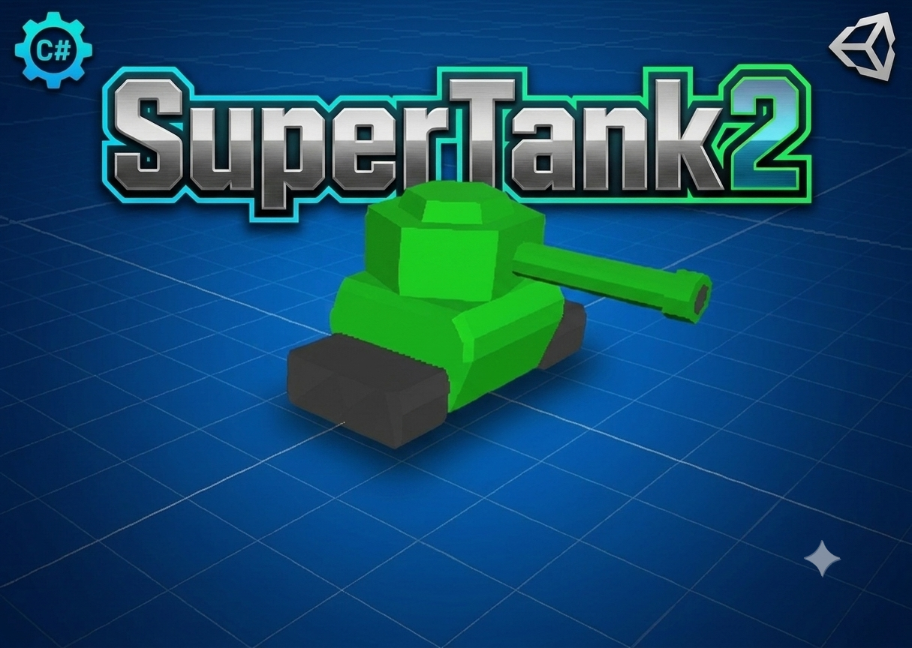
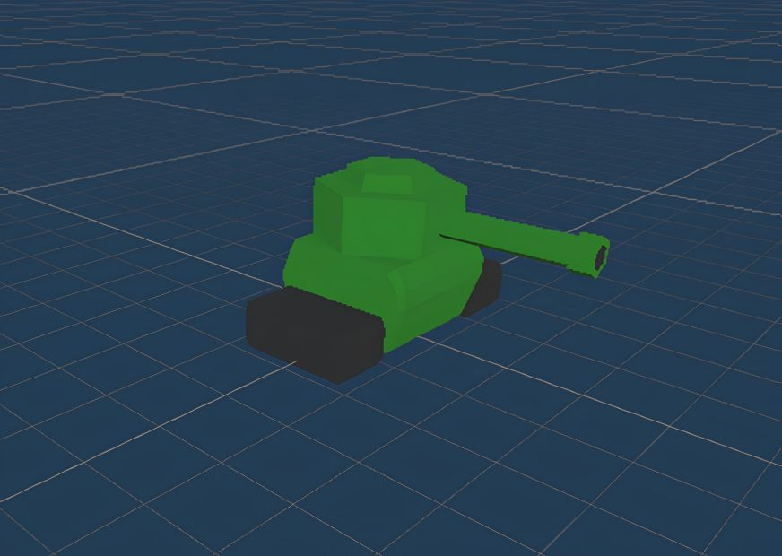
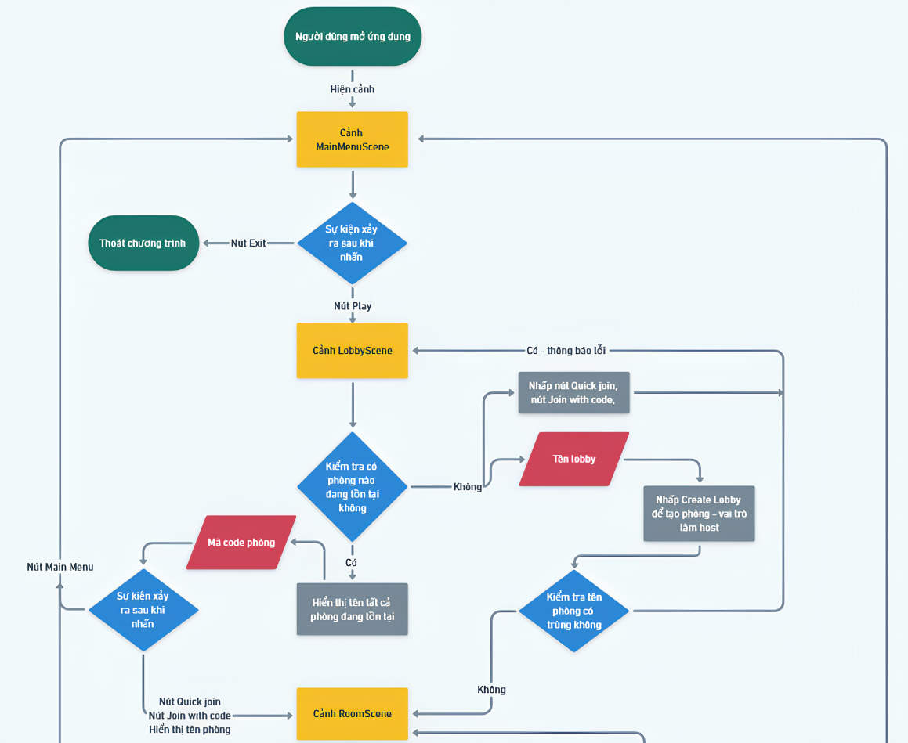
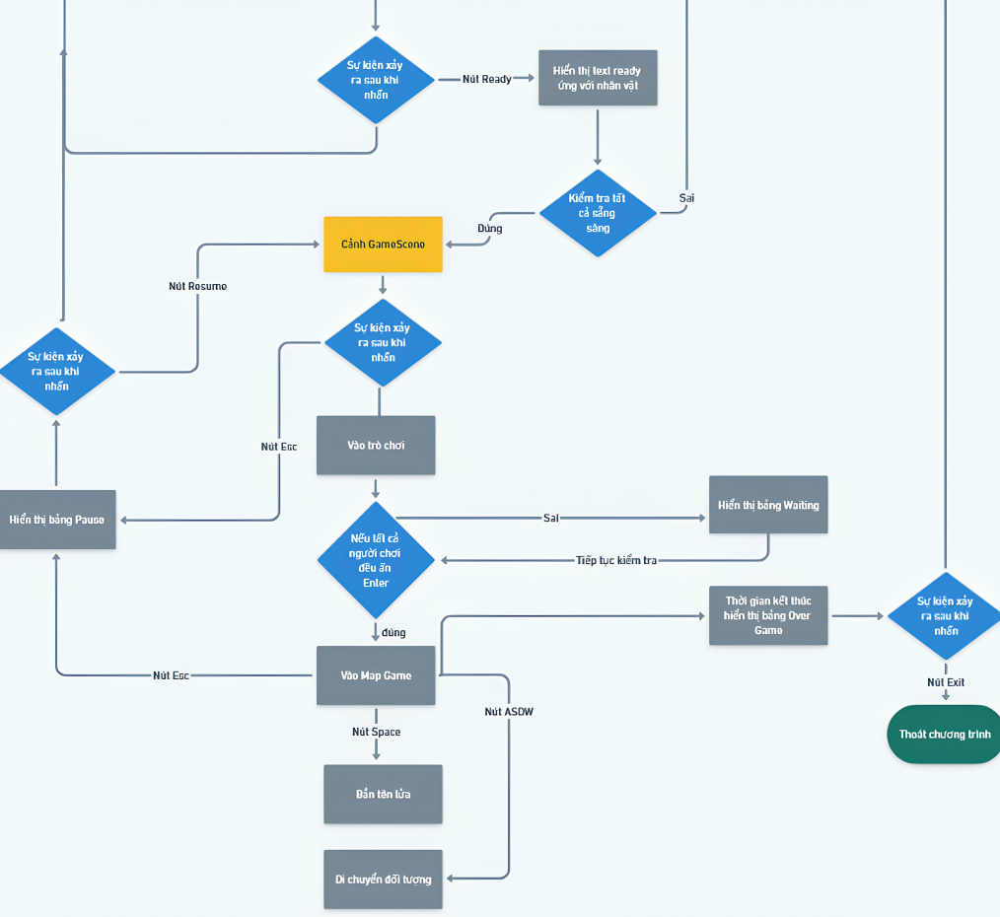

***
# Combat 3D - Unity Multiplayer Tank Battle Game

## Tổng quan trò chơi
- Trò chơi là phiên bản 3D lấy ý tưởng từ tựa game “Combat” ra mắt năm 1977
dành cho máy chơi game Atari 2600. Tương tự như trò chơi cổ điển đó, sản phẩm
của chúng em là trò chơi bắn xe tăng với góc nhìn từ trên xuống dành cho nhiều
người chơi. Trong đó mục tiêu của người chơi là bắn phá xe tăng của những người
chơi khác.
- Đối tượng: xe tăng

  
   
  <em>Mô hình xe tăng 3D trong game</em>

## Phạm vi 
Dự án được thực hiện trong phạm vi môn học Lập trình mạng căn bản NT106.O22 - UIT K17

## Mục tiêu
- Tìm hiểu về lập trình mạng căn bản xây dựng và hiểu được cấu trúc xử lí các gói tin trong mạng
- Cơ bản về thư viện Netcode for Game Object
- Game có thể chơi nhiều người chơi 

## Nguồn gốc
Game gốc được tham khảo từ https://github.com/colonelsalt/SuperTanks

### Giao diện 

Khi mở game lên thì sẽ xuất hiện 2 đối tượng xe tăng - màu xanh và đỏ, và chơi trên cùng một máy 
- nhấp chuột trái sẽ bắn xe xanh , phải sẽ bắn xe đỏ
Luật chơi 
- Có 2 thanh ghi điểm ở 2 góc trái và phải để ghi điểm số của từng đối tượng.
- Khi một đối tượng bị tác động bởi một vật thể nổ thì thanh điểm của bên còn lại sẽ được 

### Hạn chế

- Chỉ chơi được một máy duy nhất và trên máy đó.
- Chỉ có 2 đối tượng chơi với nhau.

***
## Phát triển
### Chủ đề
- Thiết kế lại cảnh game
- Thêm nhiều người chơi
- Thêm tính năng chat 
- Thiết kế lại luật chơi 

### Chuẩn bị
- MSP Unity StarterPack https://onedrive.live.com/?authkey=%21AFgnoQPxEyxmN34&cid=73E165CE52BCC8D8&id=73E165CE52BCC8D8%21983&parId=root&o=OneUp
>_You can import custom asset packs by clicking on Assets -> Import Package -> Custom Package… in Unity’s menu bar at the top of the screen._

&copy; https://learn.microsoft.com/vi-vn/archive/blogs/uk_faculty_connection/making-games-with-c-and-unity-beginners-tutorial

- Tải thư viện Netcode for Game Object : com.unity.netcode.gameobjects

&copy; https://docs-multiplayer.unity3d.com/netcode/current/installation/

- Sử dụng ParrelSync để có thể tạo một bản sau tương tự project gốc để có thể tương tác với nhau (bản sau sẽ tự lưu giống bản gốc sau mỗi lần Save) : 

&copy; https://github.com/VeriorPies/ParrelSync

## Gameplay
- Số lượng người chơi trong phòng: tối đa 4 người chơi.
- Sau khi kết nối, người chơi sẽ được đưa vào phòng chờ.
- Trò chơi được bắt đầu khi tất cả mọi người đều sẵn sàng
- Khi vào game, người chơi sẽ được tạo 1 xe tăng vào bản đồ game
- Người chơi vào phòng sẽ theo thứ tự ứng với màu 1 chiếu xe tăng.
- Người vào đầu tiên sở hữu xe tăng màu đỏ.
- Người vào thứ hai sở hữu xe tăng màu vàng.
- Người vào thứ ba sở hữu xe tăng màu cam.
- Người vào cuối cùng sở hữu xe tăng màu xanh.
- Bắn nhau trong một thời gian nhất định
## Tính năng
- Tạo phòng chơi với số lượng nhiều người chơi (1 host – multiclients).
- Có thể tạo phòng:
    - Public: bất kì ai cx có thể vào được.
    - Private: chỉ có thể vào bằng code phòng.
    - Phòng trống lển thanh thông báo.
- Vào trò chơi:
    - Truy cập nhanh – nút Quick Join.
    - Truy cập vào bằng mã code – Nhập mã có tồn tại vào trường CODE và nhấn nút Join Code.
    - Tên hiển thị phòng đang còn trống.
- Người chơi có thể tác động vật lí lên người chơi khác.
## Kiến trúc
- Mô hình phân rã chức năng

  <em>Mô hình phân rã chức năng trong game</em>

---

## 🔒 Copyright & License

Project developed and maintained by **0xt4i**.

© 2024 **Tai Huu Nguyen**. All Rights Reserved.

> **Lưu ý:** Mọi mã nguồn và tài nguyên trong repository này thuộc sở hữu cá nhân. Vui lòng không sao chép hoặc tái sử dụng cho mục đích thương mại khi chưa có sự đồng ý.